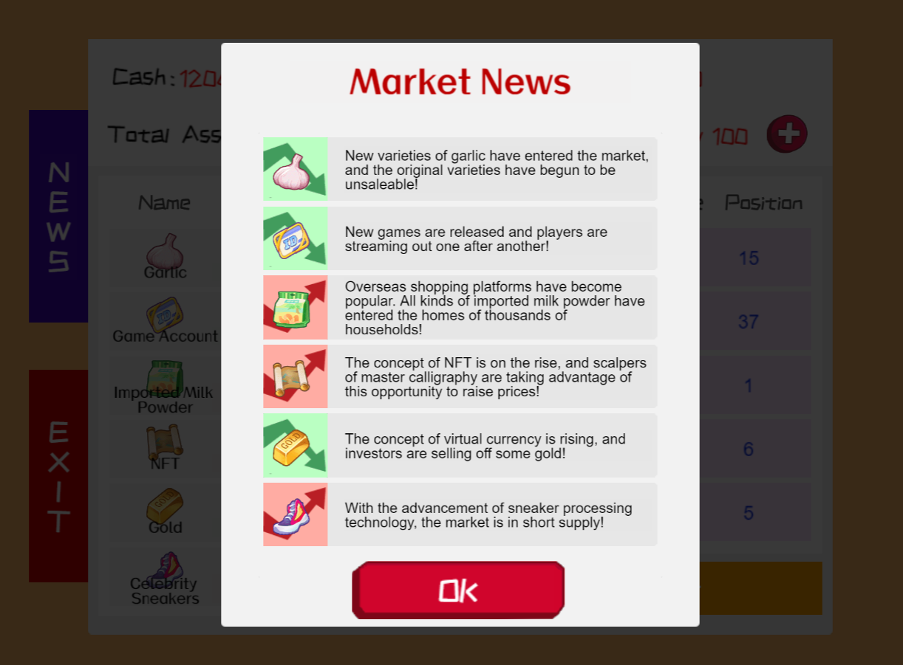

# Gaming: zkSimulatedTrading  -- V0RTEx 01 | A Scroll Hackathon

## What is zkSimulatedTrading
zkSimulatedTrading is a simple simulation game of real-world commodity trading. Through zero-knowledge proof technology, players can prove the authenticity and security of transaction results without revealing their trading strategies.

[Click to play zkSimulatedTrading](https://catkevin.github.io/zk-simulated-trading/)

## Inspiration
In real market transactions, each trader/quantitative institution has its own trading strategy, and the quality of the trading strategy determines the amount of income. Therefore, traders want to avoid leaks of their trading strategies as much as possible. Because once a trading strategy is widely known, it will be ineffective in the market trading environment.
Therefore, zkSimulatedTrading created a simple trading game. Players can prove their profitability to bystanders (private equity clients) without revealing their trading strategies (such as position status at each point in time, cash and asset ratio, trading frequency, etc.).

## example：Alice and Bob
Alice and Bob are friends, and they like playing trading games. Bob is a veteran trader. He has his own trading strategy and has a good rate of return in the futures market. But Alice doesn’t believe that Bob has such a good trading strategy and thinks that he is just lucky or may have some advice from an expert. Therefore, Alice will next verify Bob’s trading ability.
Alice found a computer. This computer can only do transactions and cannot use other software, including Google, WhatsApp, etc. This avoids the possibility of Bob's contact with the outside world.
Alice wants Bob to demonstrate his trading capabilities in front of her. In order not to leak the trading strategy, Bob asked Alice not to look at his computer screen, but to sit not far away to observe his transactions and check the account balance before and after the transaction. As long as you compare the account balance before and after the transaction, you can know Bob's profit and loss. 
Perhaps there is an element of luck in a trading cycle, but the above behavior can be repeated n times. As long as n is large enough, Bob's trading ability can be evaluated through probability theory, similar to backtesting an artificial intelligence model.

Because of the transparency of blockchain, anyone can view any data on the chain. If the player of zkSimulated Trading is equivalent to Bob, Alice is the explorer of Scroll blockchain. Bob only needs to prove his trading ability without providing his trading records.

## How to play

### 1、main scene
- Click the Start Game button on the main interface and pay the $2 registration fee to join the game.
- Click the Rank List button on the main interface to view the current scores of the most powerful players.
  

### 2、game scene
- Players can check market news and understand the reasons for market commodity price fluctuations.
  

- After entering the transaction page, you can see personal information at the top of the page, such as cash, total assets, transaction progress and maximum positions.
- Click the button next to the positions to expand the maximum number of positions by paying $10 in ETH or 50% of the current total assets in cash.

- The list on the left is a list of currently tradable products. Each column lists information such as product name, price fluctuation range, current price, etc. Click on the item to purchase it on demand based on your current cash situation.
- The list on the right is the player's position status, showing the average purchase price and position quantity of each commodity. After clicking on each column, players can selectively sell a certain number of goods and obtain transaction profits.
- After the player completes this transaction, click the Next Year button, and the program will verify the authenticity of the transaction and generate a zero-knowledge proof.
- After the transaction is completed, click the End Game button to verify the player's transaction through the smart contract and save the total asset amount after the transaction in the smart contract.
- The interaction between players and smart contracts only concerns the final score and the zero-knowledge proof of the transaction, and does not require specific transaction position data.
- Once the fees collected by the smart contract reach a certain amount, the smart contract will automatically distribute the rewards to the players with the highest score in the current season.

## How I build it
### 1、logo
I use photoshop to draw the game logo and most of the game assets

### 2、Nori
Noir is a powerful Domain-Specific Language for SNARK proving systems.I used Nori to write a zero-knowledge proof circuit for verifying the correctness of transactions in the game. 

[Nori circuits code is here](https://github.com/CatKevin/zk-simulated-trading/tree/main/circuits)

### 3、Sindri
Sindri is the ZK Developer Cloud providing builders with accessible, streamlined infrastructure often required for developing, deploying and scaling ZK. 
I use Sindri to run a zero-knowledge proof circuit and generate zero-knowledge proofs in the game. Because local program generation of zero-knowledge proofs is slow and does not meet the concurrency brought about by high-frequency trading in our game, I chose to use Sindri. The time it takes for Sindri to generate proofs is incredibly fast! ! !

[Sindri's code is here](https://github.com/CatKevin/zk-simulated-trading/blob/main/gaming/assets/Script/Components/web3/web3.ts#L248-L383)

[CIRCUIT_ID: 53c9ed41-50f1-4d47-a306-705f50d8262d](https://github.com/CatKevin/zk-simulated-trading/blob/main/gaming/assets/Script/Components/web3/config.js#L3)

### 4、Chainlink Data Feeds
Chainlink Data Feeds are the quickest way to connect your smart contracts to the real-world data such as asset prices, reserve balances, and L2 sequencer health.
I do so much with Chainlink Data Feeds! I use AggregatorV3Interface to get the latest prices of btc, eth, usdt, etc., save them to the current player's on-chain data, and control the generation of market simulation data in the game, especially the BTC price in the game.
And I also found a very good use case. I wrote the calUsdToEthAmount method in the smart contract to estimate the amount of ETH required by the current user to pay a certain amount of US dollars, so that when starting the game, $2 is paid and the maximum capacity of the expanded positions is paid. At $10, you can accurately estimate the amount of ETH that players need to send.

[Chainlink Data Feeds's code is here](https://github.com/CatKevin/zk-simulated-trading/blob/main/contract/Game.sol)

### 5、Scroll  Sepolia Testnet
Verified smart contracts：

[GAME_CONTRACT_ADDRESS: 0x252CB7801c9793e9607ACFcE4253547b993026bA](https://sepolia.scrollscan.com/address/0x252cb7801c9793e9607acfce4253547b993026ba)

[VERIFY_CONTRACT_ADDRESS: 0x497B05AC1F135B390d5Ac0c2dDb06C5a915Af46F](https://sepolia.scrollscan.com/address/0x497b05ac1f135b390d5ac0c2ddb06c5a915af46f)